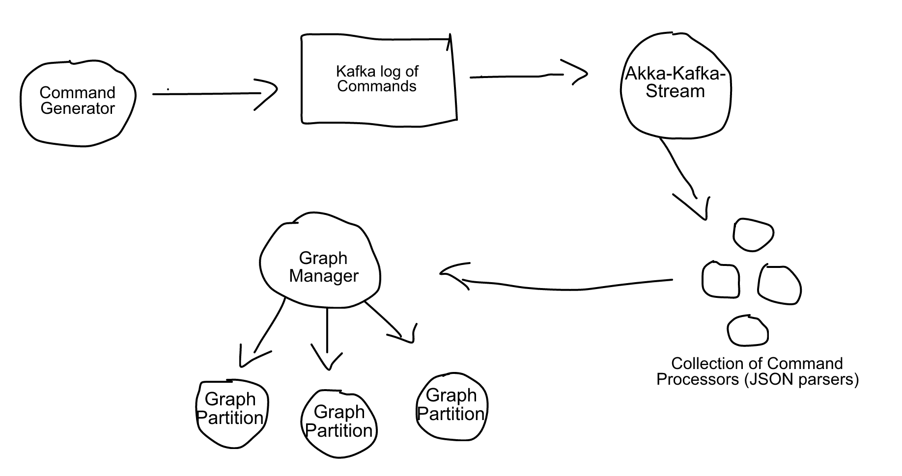

# Distributed Graphs

##Quick Overview 


Commands are generated and stored in Kafka. These commands were originally basic strings, but the parsing was done on spaces which is a horrid practice. Now swapped over to JSON and look something like the following:

```javascript 
{
	"addVertex": {
		"srcID": 0,
		"properties": {
			"property1": -118296207,
			"property2": -1700764972
		}
	}
}
```  
This can be seen in __src/kafka/jsonGenerator__

Akka-Kafka-Stream is then utilised to read these commands into the actor system. This is done within __src/akka/Execution/ConsumerTest__. Also within here we create the __GraphManager__ (The top manager actor for the graph) and a set of __CommandProcessor__ actors. 

The stream passes each incoming command to one of the __CommandProcessors__ (via a round robin selection). These then decide which type of command it is (parse from Json into an established case class) and send this as a message to the graph manager.  The __GraphManager__ then routes this to the Partition handling the involved vertex. 

The __GraphPartition__ then stores the new vertex in a map. __GraphEntities__ in this system are resonably simple at the moment, they just have their srcID (and dst if an edge) and a map for their associated properties. 

Currently just __AddVertex__ and __AddVertexProperty__ are implemented as commands. This is because it took me a little while to swap over from strings to JSON. Will be doing the edges now and then looking into updates and removes.  